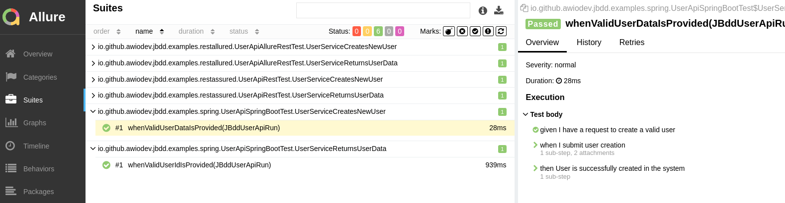
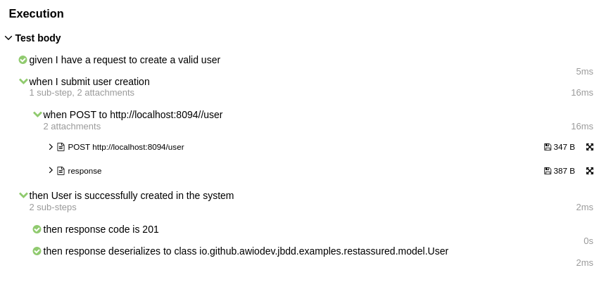
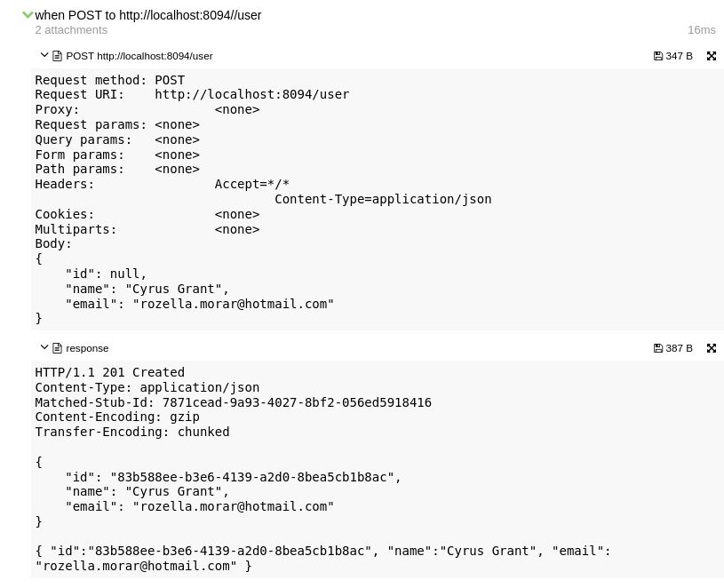

# jBdd

Simple BDD abstraction especially for integration/component tests!

This library has been created for the purpose of writing business oriented integration and component tests.

These days BDD is pretty commonly used concept but let's be honest, current frameworks are not very warm welcomed by software developers.
In most of the cases using frameworks like Cucumber on integration/component level is painful for software developers.
We want to implement our tests quickly!

This library tries to address this problem. It provides an abstraction layer allowing to implement BDD like tests.

It also contains extensions allowing to generate nice tests reports that follows BDD concept.

Current implementation is focused on delivering generic BDD steps, JUnit extension, rest operations, reporting wrappers and SpringBoot configuration classes.

Please fell free to contribute if you need jBdd in other areas! 

**Please note: Version 1.0.0+ is no longer supported. Please start from v2+**

## Supported Java runtime

* Java 11+

## Fundamentals

In case you need more info on BDD we recommend to go through [Understanding BDD](https://www.baeldung.com/cs/bdd-guide) guide.

## Library modules

* **jbdd-core** - core abstraction and default implementations for all BDD objects.
* **jbdd-junit5** - JUnit5 extension allowing to inject BDD context into Junit tests.
* **jbdd-allure** - given/when/then steps wrapper for Allure. All scenario steps will be visible in the allure report.
* **jbdd-spring-boot** - Spring configuration class that performs configuration of jBdd objects. Class can be extended and default methods overriden.  
* **jbdd-rest-assured** - rest-assured actions and steps that can be added to your jBdd run.
* **jbdd-rest-allured** - Allure wrapper around rest-assured steps so http communication can be included in the report.
* **usage-examples** - examples of business steps implementation, custom run and tests.

## Concept

Our goal is to be able to create BDD scenarios inside test method. 
In order to achieve that we introduced `JBddRun`. 
This top level object is responsible for delivering `JBddSteps` (which contains given/when/then statements)
and `JBddContext` which is kind of database for the run variables, so they can be shared across steps.

We recommend to inject `JBddRun` as a parameter of Junit5 test method using `JBddExtension`. 

## Usage

All usage examples are available under `usage-examples` module. 
Let's focus here on the most important part - setting up dev env and quick start.

### Build Configuration

#### jbdd-core library

##### Maven

```xml
<dependency>
    <groupId>io.github.awiodev</groupId>
    <artifactId>jbdd-core</artifactId>
    <version>2.0.0</version>
</dependency>
```

##### Gradle

```groovy
implementation 'io.github.awiodev:jbdd-core:2.0.0'
```

#### jbdd-allure library

Library will deliver `jbdd-core` jar so there is no need to add core lib dependency separately.  

##### Maven

```xml
<dependency>
    <groupId>io.github.awiodev</groupId>
    <artifactId>jbdd-allure</artifactId>
    <version>2.0.0</version>
</dependency>
```

##### Gradle

```groovy
implementation 'io.github.awiodev:jbdd-allure:2.0.0'
```

#### jbdd-junit5 library

Library will deliver `jbdd-core` jar so there is no need to add core lib dependency separately.

##### Maven

```xml
<dependency>
    <groupId>io.github.awiodev</groupId>
    <artifactId>jbdd-junit5</artifactId>
    <version>2.0.0</version>
</dependency>
```

##### Gradle

```groovy
implementation 'io.github.awiodev:jbdd-junit5:2.0.0'
```

#### jbdd-rest-assured library

Library will deliver `jbdd-core` jar so there is no need to add core lib dependency separately.
Additionally, it will download all required rest-assured libraries. 

##### Maven

```xml
<dependency>
    <groupId>io.github.awiodev</groupId>
    <artifactId>jbdd-rest-assured</artifactId>
    <version>2.0.0</version>
</dependency>
```

##### Gradle

```groovy
implementation 'io.github.awiodev:jbdd-rest-assured:2.0.0'
```

#### jbdd-rest-allured library

Library will deliver `jbdd-allure` and `jbdd-rest-assured` jars so there is no need to add dependencies separately.

##### Maven

```xml
<dependency>
    <groupId>io.github.awiodev</groupId>
    <artifactId>jbdd-rest-allured</artifactId>
    <version>2.0.0</version>
</dependency>
```

##### Gradle

```groovy
implementation 'io.github.awiodev:jbdd-rest-allured:2.0.0'
```

#### jbdd-spring-boot library

Library will deliver `jbdd-core` and `jbdd-junit5` jars so there is no need to add dependencies separately.

##### Maven

```xml
<dependency>
    <groupId>io.github.awiodev</groupId>
    <artifactId>jbdd-spring-boot</artifactId>
    <version>2.0.0</version>
</dependency>
```

##### Gradle

```groovy
implementation 'io.github.awiodev:jbdd-spring-boot:2.0.0'
```

### Injecting jBddRun into test methods

#### JUnit5 automatic registration 

In order to inject `JBdd` run object use `@ExtendWith(JBddExtension.class)` annotation.
It will inject default implementation of all JBdd objects. 
In order to inject custom implementation of steps or context use manual registration.

```java
@ExtendWith(JBddExtension.class)
public class JBddAutomaticExtensionRegistrationTest {

    @Nested
    class UserIsCreated {

        @Test
        void whenValidUserDataIsSubmitted(JBdd jBdd) {
            jBdd.scenario().given("I am an authenticated user", () -> {
                // TODO: implement steps
            }).when("I submit user creation form", () -> {
                // TODO: implement steps
            }).then("User is successfully created in the system", () -> {
                // TODO: implement steps
            });
        }
    }
}
```

#### JUnit5 manual registration

All jBdd classes can be instantiated using builders. In below example we register `JBddExtension` using `@RegisterExtension` junit5 annotation.  

```java
public class JBddManualExtensionRegistrationTest {

    private final List<String> events = new ArrayList<>();

    @RegisterExtension
    private final JBddExtension extension = JBddExtension.builder()
        .withSetupAndTearDown(() -> {
            events.add("start");
            return JBdd.builder()
                .withSteps(JBddStandardSteps.builder().build())
                .build();
        }, run -> {
            events.add("stop");
            run.clean();
        })
        .withObjectsDatabase(ObjectsMapDatabase.builder().build())
        .build();
    
    @Nested
    class UserIsCreated {

        @Test
        void whenValidUserDataIsSubmitted(JBdd jBdd) {
            jBdd.scenario().given("I am an authenticated user", () -> {
                // TODO: implement steps
            }).when("I submit user creation form", () -> {
                // TODO: implement steps
            }).then("User is successfully created in the system", () -> {
                // TODO: implement steps
            });
        }
    }
}
```

#### Spring dependency injection

Library `jbdd-spring-boot` delivers default `Configuration` class that builds default implementations of jBdd objects.

```java
@Configuration
public class JBddStandardConfiguration {

    @Bean
    public JBddContextFactory<?> jBddContextFactory() {
        return JBddStandardContextFactory.builder().build();
    }

    @Bean
    public JBddSteps<?> jBddSteps() {
        return JBddStandardSteps.builder().build();
    }

    @Bean
    public JBddExtension jBddExtension(JBddSteps<?> steps, JBddContextFactory<?> contextFactory) {
        return JBddExtension.builder()
            .withSetupAndTearDown(() -> JBdd.builder()
                .withSteps(steps)
                .withContextFactory(contextFactory)
                .build(), JBddRun::clean)
            .build();
    }
}
```
It can be extended and custom implementation provided as below.

```java
@Configuration
public class JBddRestAlluredConfiguration extends JBddStandardConfiguration {

    private static final int USER_SERVICE_PORT = 8094;

    private static final String USER_SERVICE_BASE_URL =
        String.format("http://localhost:%s", USER_SERVICE_PORT);

    @Bean
    Faker faker() {
        return new Faker(new Random(24));
    }

    @Bean(destroyMethod = "stop")
    WireMockServer wireMockServer() {
        return new WireMockServer(USER_SERVICE_PORT);
    }

    @Bean
    FakeUserServiceSteps fakeUserServiceSteps(WireMockServer wireMockServer, Faker faker) {
        return new FakeUserServiceSteps(wireMockServer, faker);
    }

    @Bean
    UserApiSteps userApiSteps() {
        return UserApiRestSteps.builder()
            .withBaseUrl(USER_SERVICE_BASE_URL)
            .withRestAssuredSteps(JBddRestAlluredStandardSteps.builder()
                .withRestAssuredSteps(JBddRestAssuredStandardSteps.builder()
                    .withRestAssuredActions(RestAssuredActions.builder()
                        .withFilters(
                            List.of(new RequestLoggingFilter(), new ResponseLoggingFilter(),
                                new AllureRequestLogFilter(), new AllureResponseLogFilter()))
                        .build())
                    .build())
                .build())
            .build();
    }

    @Override
    @Bean
    public JBddSteps<?> jBddSteps() {
        return JBddAllureSteps.builder().build();
    }

    @Bean
    public JBddExtension jBddExtension(JBddSteps<?> steps, JBddContextFactory<?> contextFactory,
                                       FakeUserServiceSteps fakeUserServiceSteps,
                                       UserApiSteps userApiSteps, Faker faker) {
        return JBddExtension.builder()
            .withSetupAndTearDown(() -> JBddUserApiRun.builder()
                    .withJBddSteps(steps)
                    .withJBddStandardContextFactory((JBddStandardContextFactory) contextFactory)
                    .withFakeUserServiceSteps(fakeUserServiceSteps)
                    .withApiSteps(userApiSteps)
                    .withFaker(faker)
                    .build(),
                JBddRun::clean)
            .build();
    }
}
```

Then on test level it can be registered using `@ContextConfiguration` and `@Autowired` annotations as below.

```java
@SpringBootTest
@ContextConfiguration(classes = {JBddRestAlluredConfiguration.class})
public class UserApiSpringBootTest {

    @RegisterExtension
    @Autowired
    public JBddExtension jBddExtension;

    @Nested
    class UserServiceCreatesNewUser {

        @Test
        void whenValidUserDataIsProvided(JBddUserApiRun jBddRun) {
            jBddRun.scenario().given("I have a request to create a valid user", () -> {
                var user = new User();
                user.setName(jBddRun.faker().name().fullName());
                user.setEmail(jBddRun.faker().internet().emailAddress());
                jBddRun.fakeUserServiceSteps().givenUserServiceAcceptsUser(user);
                jBddRun.context().store(user);
            }).when("I submit user creation", () -> {
                Response response =
                    jBddRun.userApiSteps().whenCreatesUser(jBddRun.context().get(User.class));
                jBddRun.context().store("response", response);
            }).then("User is successfully created in the system", () -> {
                Response response = jBddRun.context().get("response", Response.class);
                jBddRun.userApiSteps().thenUserIsCreatedSuccessfully(response);
            });
        }
    }
}
```

### Allure reporting

Allure jBdd libraries provides basic reporting features to scenario steps. 

Scenario in Java:
```java
@Nested
    class UserServiceCreatesNewUser {

        @Test
        void whenValidUserDataIsProvided(JBddUserApiRun jBddRun) {
            jBddRun.scenario().given("I have a request to create a valid user", () -> {
                var user = new User();
                user.setName(jBddRun.faker().name().fullName());
                user.setEmail(jBddRun.faker().internet().emailAddress());
                jBddRun.fakeUserServiceSteps().givenUserServiceAcceptsUser(user);
                jBddRun.context().store(user);
            }).when("I submit user creation", () -> {
                Response response =
                    jBddRun.userApiSteps().whenCreatesUser(jBddRun.context().get(User.class));
                jBddRun.context().store("response", response);
            }).then("User is successfully created in the system", () -> {
                Response response = jBddRun.context().get("response", Response.class);
                jBddRun.userApiSteps().thenUserIsCreatedSuccessfully(response);
            });
        }
    }
```
Will be presented in the following way in Allure reports:



Some of the steps may be expanded so more detailed information is presented:



Rest communication is also presented as an attachment:



## Conclusion

JBdd delivers very basic functionality to deliver BDD like scenarios in pure Java. 
It is ready to be extended and customized for the specific project needs.  
